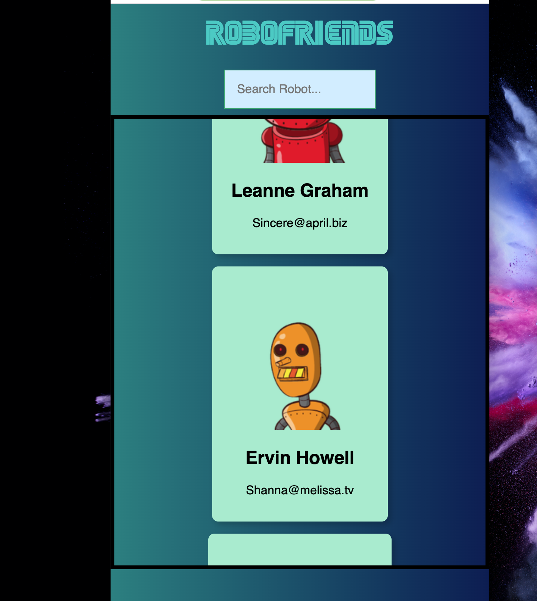
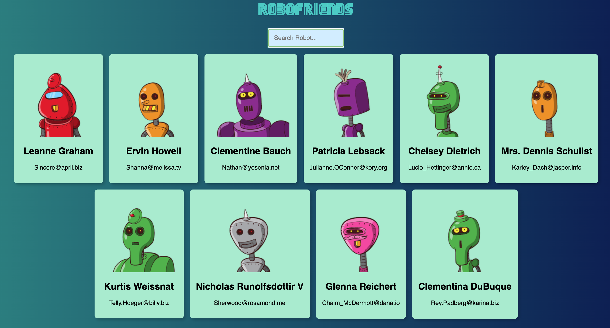
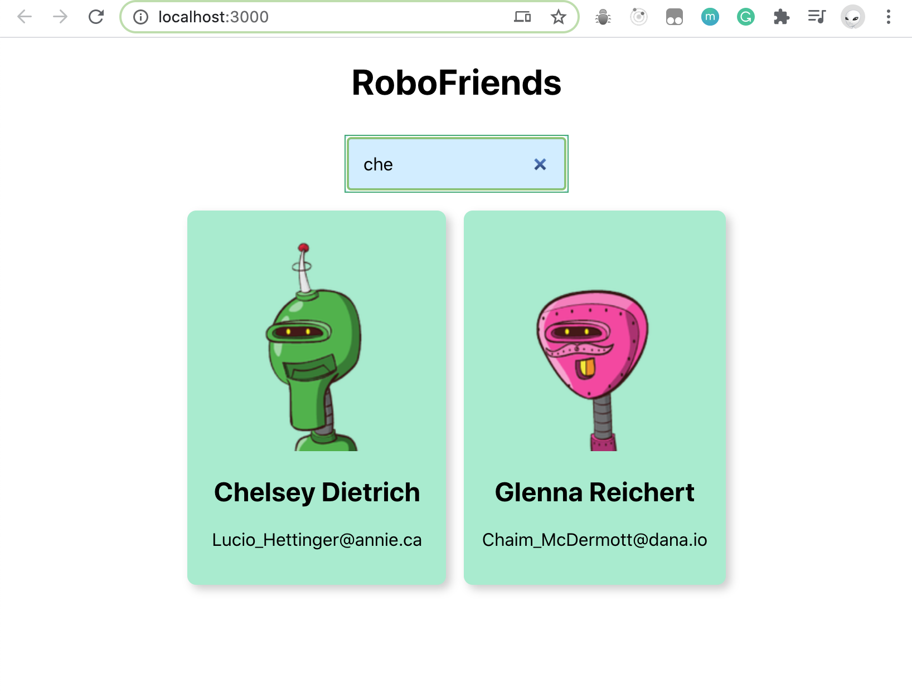
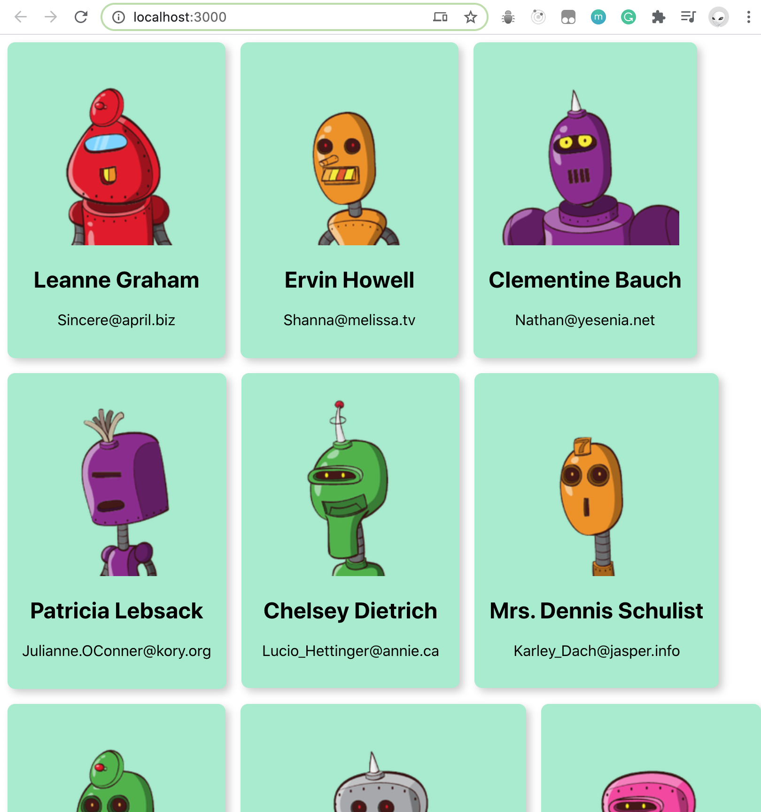

# RoboFriends

### Tech Stack

- tachyons
- RoboHash - API

------

#### Version8:

- add testing
  - Jest, Enzyme
    - unit testing
    - stateless component testing
    - stateful component testing

#### Version7:

- apply Redux

#### Version6:

- clean file structure
- add Error Boundry component

#### Version5:

- reusable "Scroll Window" Component

  

#### Version4:

- fetch data from "jsonplaceholder"

#### Version3:

- add gradient background
- add cool sega fonts

#### Version2:

- CardList
- SearchBox

#### Version1:

- Add Card

